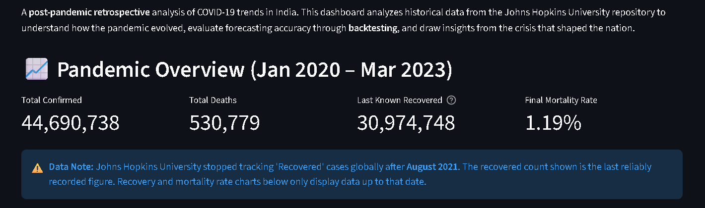
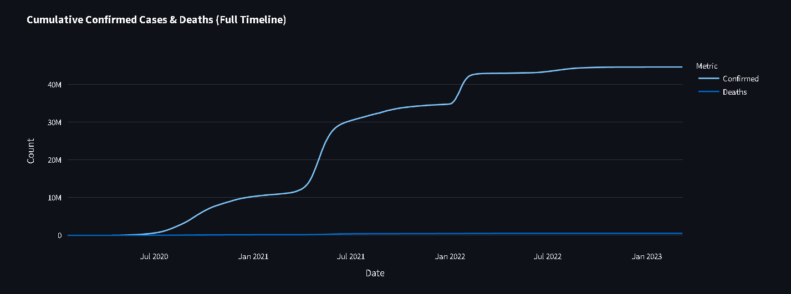
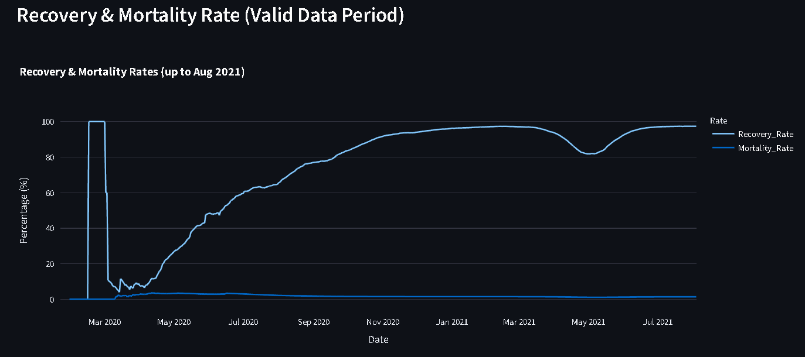
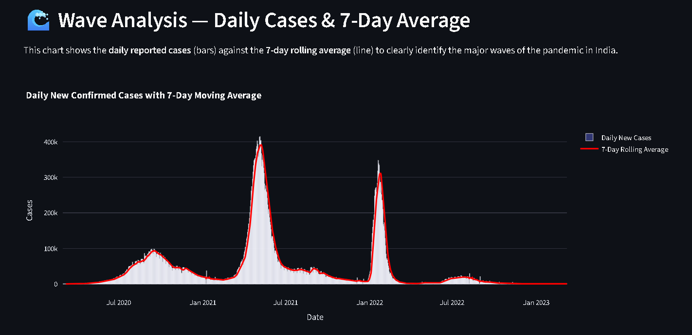
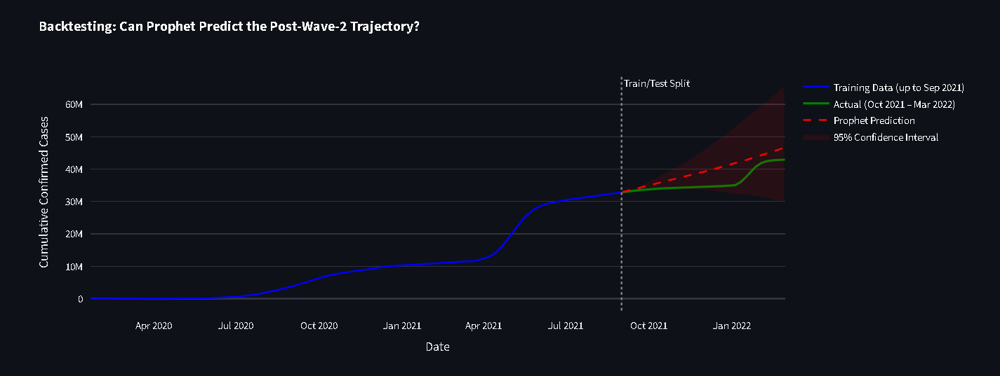
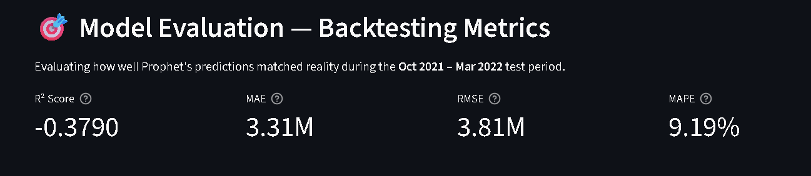

# 🦠 COVID-19 India Retrospective Analysis Dashboard

A comprehensive, interactive web dashboard built with **Streamlit**, **Plotly**, and **Facebook Prophet** to analyze historical COVID-19 trends in India. This project performs a post-pandemic retrospective analysis, evaluating forecasting accuracy through backtesting and drawing meaningful insights from the crisis that shaped the nation.



---

## 📌 Table of Contents

- [Project Overview](#project-overview)
- [Features](#features)
- [Screenshots](#screenshots)
- [Tech Stack](#tech-stack)
- [Dataset](#dataset)
- [Installation & Setup](#installation--setup)
- [Deployment](#deployment)
- [Key Insights](#key-insights)

---

## 🎯 Project Overview

The **COVID-19 India Retrospective Analysis Dashboard** is a data science project that visualizes and analyzes the complete timeline of the COVID-19 pandemic in India (Jan 2020 – Mar 2023). 

Instead of making meaningless future predictions (since the pandemic is over), this project uses **backtesting** — training the Prophet model on historical data and validating it against known outcomes. This approach demonstrates real-world data science practices and model evaluation techniques.

---

## ✨ Features

- 📊 **Interactive Visualizations** — Explore cumulative cases, deaths, and trends using Plotly
-  **Wave Analysis** — Clearly identify the three major waves of the pandemic with 7-day rolling averages
- 📉 **Recovery & Mortality Rates** — Track India's healthcare response over time (using valid data period only)
- 🔮 **Forecast Backtesting** — Prophet model trained on pre-Wave-2 data and validated against the Omicron wave
- 🎯 **Model Evaluation Metrics** — R² Score, MAE, RMSE, and MAPE for rigorous model assessment
- 🧭 **Sidebar Navigation** — Clean, section-based dashboard UI for easy exploration

---

## 📸 Screenshots

### 1. Pandemic Overview & Summary Metrics

*Dashboard summary showing Total Confirmed, Total Deaths, Last Known Recovered, and Final Mortality Rate.*

### 2. Cumulative Confirmed Cases

*The complete timeline showing the cumulative growth of Confirmed Cases and Deaths in India.*

### 3. Recovery & Mortality Rates

*Recovery rate peaked around 98% before the Delta wave, while mortality remained relatively stable below 1.5%.*

### 4. Wave Analysis — Daily Cases & 7-Day Average

*Three distinct waves clearly visible: Wave 1 (Sep 2020), Wave 2 / Delta (May 2021), Wave 3 / Omicron (Jan 2022).*

### 5. Forecast Backtesting

*Prophet trained on data up to Sep 2021, predicting the next 6 months. The model captures the general trajectory, though it couldn't foresee the unprecedented Omicron spike.*

### 6. Model Evaluation Metrics

*Backtesting metrics including R² Score, MAE, RMSE, and MAPE to evaluate how well Prophet's predictions matched reality during the test period.*

---

## 🛠️ Tech Stack

| Technology | Purpose |
|-----------|---------|
| **Python 3.10+** | Core programming language |
| **Streamlit** | Interactive web application framework |
| **Plotly** | Interactive, hover-enabled visualizations |
| **Facebook Prophet** | Time series forecasting & backtesting |
| **Pandas** | Data manipulation & preprocessing |
| **Scikit-learn** | Model evaluation metrics (R², MAE, RMSE, MAPE) |
| **Johns Hopkins University Dataset** | Live COVID-19 data source |

---

## 📊 Dataset

**Source:** [Johns Hopkins University COVID-19 Data Repository](https://github.com/CSSEGISandData/COVID-19)

The dashboard uses three time-series CSV files:
- `time_series_covid19_confirmed_global.csv`
- `time_series_covid19_deaths_global.csv`
- `time_series_covid19_recovered_global.csv`

**Data Range:** January 22, 2020 – March 9, 2023  
**Geographic Scope:** Global data, filtered for India and its states  

> ⚠️ **Important Note:** JHU stopped tracking "Recovered" cases after ~March 2022. The dashboard intelligently detects this and only displays recovery rates for the valid data period.

---

## ️ Installation & Setup

### Prerequisites
- Python 3.10 or higher
- pip (Python package manager)

### Step 1: Clone the Repository
```bash
git clone https://github.com/<your-username>/covid19-india-dashboard.git
cd covid19-india-dashboard
